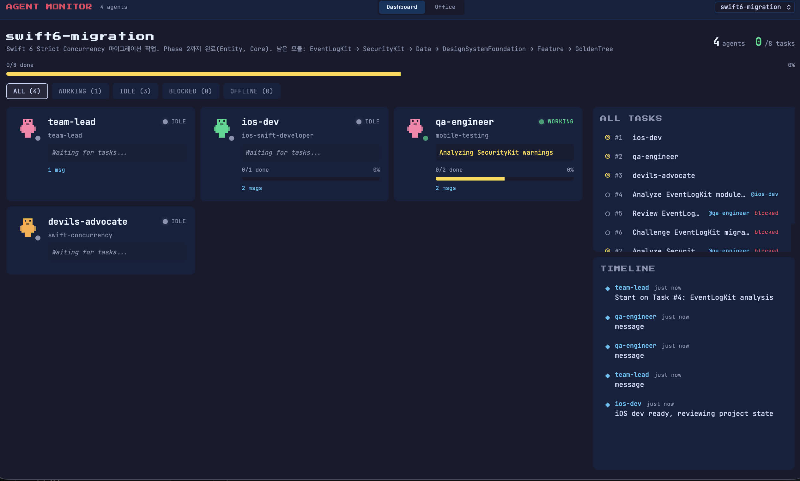
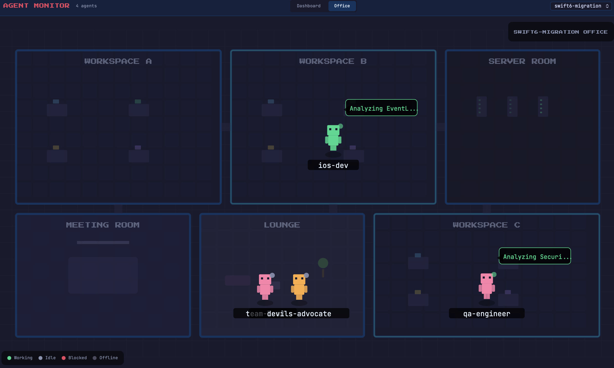

# Agent Monitor

<div align="center">


**Real-time visualization for Claude Code Agent Teams**

A desktop app for macOS and Windows that monitors your Claude Code agent teams with a pixel-art virtual office and a live dashboard.

[한국어](./README_KO.md)


</div>

---

## Screenshots

### Dashboard View



> Agent cards, status filters, task list, and event timeline — all in one view.

### Office View



> Pixel-art virtual office where agents move between rooms based on their status.

---

## Overview

When you create agent teams with Claude Code's `TeamCreate` tool, Agent Monitor automatically detects them and provides two views:

- **Dashboard View** — Agent cards, status filters, task list, and event timeline
- **Office View** — Pixel-art characters in a virtual office, moving between rooms based on their status

The app reads directly from Claude Code's local data files (`~/.claude/teams/` and `~/.claude/tasks/`) and updates in real time via file system watching.

## Features

- **Live Monitoring** — File system watcher + 3-second polling for instant updates
- **Dashboard View** — Agent cards with status badges, progress bars, task ownership, and message counts
- **Office View** — SVG pixel-art office with 6 rooms (workspaces, meeting room, lounge, server room)
- **Animated Agents** — Walking, idle bounce, speech bubbles, status glow indicators
- **Status Filtering** — Filter agents by working / idle / blocked / offline
- **Multi-Team Support** — Switch between teams via dropdown
- **Auto-Launch** — Daemon starts the app when a team is created (LaunchAgent on macOS, Task Scheduler on Windows)
- **Dark Pixel-Art Theme** — Retro game-inspired UI with Press Start 2P and JetBrains Mono fonts

## Requirements

### macOS
- **macOS** 10.15+
- **Node.js** 18+
- **Rust** (installed automatically if missing)
- **Xcode Command Line Tools**

### Windows
- **Windows** 10+
- **Node.js** 18+
- **Rust** (installed automatically if missing)
- **Visual C++ Build Tools** (for building from source)

## Installation

### npx (Recommended)

```bash
npx claude-agent-monitor
```

Downloads a pre-built binary and sets up auto-launch. No build tools required.

### curl

```bash
curl -fsSL https://raw.githubusercontent.com/Glsme/agent-monitor/main/scripts/install.sh | bash
```

Downloads the pre-built binary, falls back to building from source if needed.

### From Source

```bash
git clone https://github.com/Glsme/agent-monitor.git
cd agent-monitor
bash scripts/install.sh
```

### Development

```bash
git clone https://github.com/Glsme/agent-monitor.git
cd agent-monitor
npm install
npm run tauri dev
```

### Windows Installation

#### npx (Recommended)

```powershell
npx claude-agent-monitor
```

#### PowerShell

```powershell
irm https://raw.githubusercontent.com/Glsme/agent-monitor/main/scripts/install.ps1 | iex
```

#### From Source

```powershell
git clone https://github.com/Glsme/agent-monitor.git
cd agent-monitor
powershell -ExecutionPolicy Bypass -File scripts/install.ps1
```

## Usage

### Automatic Mode

After installation, Agent Monitor runs automatically:

1. The daemon watches `~/.claude/teams/` every 5 seconds
2. When you create a team in Claude Code (`TeamCreate`), the app launches automatically
3. Select your team from the dropdown in the header
4. Toggle between **Dashboard** and **Office** views

### Manual Launch

**macOS:**
```bash
open ~/Applications/Agent\ Monitor.app
```

**Windows:**
```powershell
& "$env:LOCALAPPDATA\AgentMonitor\Agent Monitor.exe"
```

### Views

#### Dashboard

| Element | Description |
|---------|-------------|
| **Agent Cards** | Shows each agent's name, type, status, current task, and progress |
| **Status Filter** | Filter agents by status: All / Working / Idle / Blocked |
| **Task List** | All tasks with owner, status, and blocked indicators |
| **Timeline** | Chronological event feed (task started, completed, messages) |

Click an agent card to filter the task list and timeline for that agent.

#### Office

| Room | Agents Shown |
|------|-------------|
| **Workspace A/B/C** | Working agents (distributed across rooms) |
| **Meeting Room** | Blocked agents (discussing blockers) |
| **Lounge** | Idle agents (waiting for tasks) |
| **Server Room** | Offline agents |

Click an agent character to see their details in the bottom panel.

## Data Sources

Agent Monitor reads from Claude Code's local files:

| Path | Content |
|------|---------|
| `~/.claude/teams/{team}/config.json` | Team config (name, members, roles) |
| `~/.claude/tasks/{team}/{id}.json` | Individual task data |
| `~/.claude/teams/{team}/inboxes/{agent}.json` | Agent messages |

No data is sent anywhere. Everything stays local.

## Architecture

```
agent-monitor/
├── src-tauri/           # Rust backend
│   └── src/lib.rs       # Tauri commands: list_teams, get_team_snapshot, watch_team
├── src/
│   ├── types/           # TypeScript type definitions
│   ├── hooks/           # useTeamData hook (Tauri API + polling)
│   ├── components/
│   │   ├── common/      # StatusBadge, Panel, Tooltip, ViewToggle, etc.
│   │   ├── dashboard/   # AgentCard, StatusFilter, Timeline, TaskList
│   │   └── office/      # PixelAgent, OfficeRoom, OfficeView (SVG)
│   └── App.tsx          # App shell with view toggle and team selector
├── scripts/
│   ├── install.sh       # macOS installer
│   ├── install.ps1      # Windows installer
│   ├── uninstall.sh     # macOS removal
│   ├── uninstall.ps1    # Windows removal
│   ├── agent-monitor-daemon.sh   # macOS auto-launch daemon
│   └── agent-monitor-daemon.ps1  # Windows auto-launch daemon
└── docs/                # Spec, data model, design system, UX, QA
```

## Uninstall

```bash
bash scripts/uninstall.sh

# Or manually
launchctl unload ~/Library/LaunchAgents/com.agent-monitor.daemon.plist
rm -rf ~/Applications/Agent\ Monitor.app
rm -rf ~/.agent-monitor
rm ~/Library/LaunchAgents/com.agent-monitor.daemon.plist
```

### Windows

```powershell
powershell -ExecutionPolicy Bypass -File scripts/uninstall.ps1

# Or manually
schtasks /Delete /TN "AgentMonitorDaemon" /F
Remove-Item "$env:LOCALAPPDATA\AgentMonitor" -Recurse -Force
Remove-Item "$env:USERPROFILE\.agent-monitor" -Recurse -Force
```

## Tech Stack

| Layer | Technology |
|-------|-----------|
| **Desktop Framework** | Tauri v2 |
| **Backend** | Rust (serde, notify, tauri-plugin-fs) |
| **Frontend** | React 18 + TypeScript |
| **Styling** | Tailwind CSS |
| **Graphics** | SVG (pixel art) |
| **Build** | Vite |

## License

MIT

## Contributing

Contributions are welcome! Please read the docs in `docs/` for architecture details before submitting PRs.
